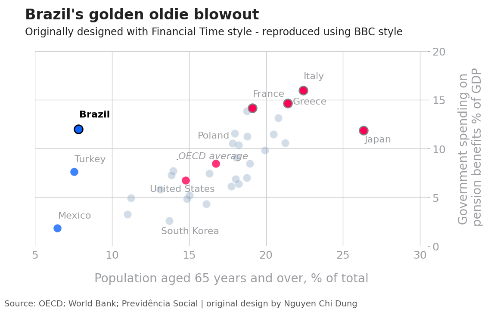

# bbcstyle
bbcstyle is a lightweight Python package that applies a BBC News-inspired visual theme to Matplotlib and Seaborn plots. It helps you create clean, publication-ready charts with consistent typography, minimalist gridlines, and optional source annotations or logos. Inspired by the R package [`bbplot`](https://github.com/bbc/bbplot)  but tailored for Python. this theme is ideal for reports, dashboards, and data journalism.

